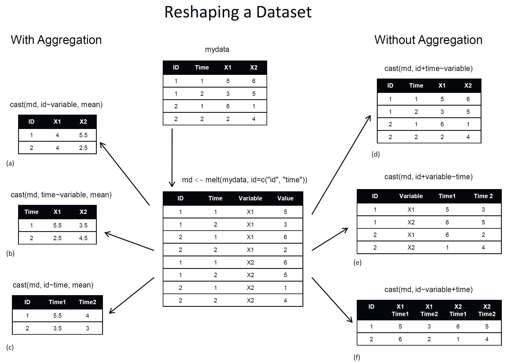

# Ch01：表格型文件的輸入與輸出
```{r setup, include=FALSE, cache=FALSE}
library(knitr)
library(magrittr)
library(xtable)
library(dplyr)
library(ggplot2)
opts_chunk$set(echo = TRUE, cache=TRUE, comment="", cache.path = ".cache-EDA/")
fig <- function(path, size = 100) {
  sprintf("</img>", 
          path, size, size)
}
fig2 <- function(path, size = 100) {
  sprintf("</img>", 
          path, size)
}
sys_name <- Sys.info()["sysname"] %>% tolower
sys_encode <- c("utf8", "utf8", "big5")[pmatch(sys_name, c("linux", "darwin", "windows"))]
sessionInfo() %>% capture.output %>% cat(file = "sessionInfo.log", sep = "\n")
```


## 讀取表格檔案
- 下載範例資料
  http://johnsonhsieh.github.io/dsp-introR/data/hsb.csv
- 利用`read.csv` 讀取 `csv` 檔 (一種以逗點分隔欄位的資料格式)    

```{r echo=TRUE, eval=FALSE}
# 可以使用R指令來下載
url <- "http://johnsonhsieh.github.io/dsp-introR/data/hsb.csv"
download.file(url, destfile = "hsb.csv") # 把檔案另存成hbs.csv
dat <- read.csv("hsb.csv")
head(dat)
```
```{r echo=FALSE}
dat <- read.csv("hsb.csv")
head(dat)
```


## 讀取表格檔案
讀取自己電腦裡的csv檔
```{r echo=TRUE, eval=FALSE}
# 方法1. 透過介面選擇檔案所在路徑
path <- file.choose()
dat <- read.csv(path)

# 方法2. 自行輸入檔案所在路徑
path <- "/Volumes/LEEF SURGE/LearnR/hsb.csv"
dat <- read.csv(path)

# 方法3. 自行輸入檔案相對路徑
dat <- read.csv("hsb.csv")
```

## 輸出表格檔案
利用`write.csv`將`data.frame`格式的R物件另存成csv檔
```{r echo=TRUE, eval=FALSE}
write.csv(dat, "hsb_new.csv", row.names=FALSE, quote=FALSE)
```

## 淺談路徑設定  
- `getwd` 查詢目前所在的資料夾路徑 (絕對路徑)
- `setwd` 設定所在的資料夾路徑 <br> (Session -> Set Working Directory -> Choose Directory)
- 檔案 (檔案路徑 file directory) vs. 資料夾 (工作路徑 working directory)
```{r echo=TRUE, eval=TRUE}
getwd()
dat <- read.csv("hsb.csv")
```

## 排解疑難 - 常見的讀取錯誤1
路徑錯誤
```{r echo=TRUE, eval=FALSE}
path <- "wrong_file_path"
dat <- read.csv(file = path)
```
<pre>
Error in file(file, "rt") : 無法開啟連結
此外: Warning message:
  In file(file, "rt") : 無法開啟檔案 'wrong_file_path' ：No such file or directory
</pre>
- 絕對路徑 -> 確認檔案是否存在
- 相對路徑 -> 利用`getwd`了解R 當下的路徑位置


## 排解疑難 - 常見的讀取錯誤2
格式錯誤
```{r echo=TRUE, eval=FALSE}
path <- "hsb.csv"
dat <- read.csv(file = path, header = TRUE, sep = "1")
```
<pre>
Error in read.table(file = file, header = header, sep = sep, quote = quote,  : 
  more columns than column names
</pre>
- 利用其他編輯器確認分隔符號
- 確認每列的資料的欄位是正確的
- 必要時，請用其他文件編輯器校正欲讀取的檔案

## 排解疑難 - 常見的讀取錯誤3 
編碼錯誤
```{r echo=TRUE}
url <- "http://johnsonhsieh.github.io/dsp-introR/data/dsp-gift-2013-big5/%E8%B2%B7%E8%B3%A3st_A_10109_10109.csv"
```
```{r echo=TRUE, eval=FALSE}
dat <- read.csv(url)
```
<pre class="code">
Error in make.names(col.names, unique = TRUE) : 
  無效的多位元組字串於 <b6>m<c2><ed><a5><ab><b0><cf>
</pre>

- 查詢檔案的編碼
- 常見的中文編碼有UTF-8和BIG-5
```{r echo=TRUE, eval=FALSE}
# 利用`fileEncoding`參數選擇檔案編碼 - big5 / utf8
dat2 <- read.csv(url, fileEncoding = "big5")
```

## 讀取其他軟體資料集
- For SPSS and Stata datasets, use the `foreign` package
- Cars: [Cars.sav](http://calcnet.mth.cmich.edu/org/spss/V16_materials/DataSets_v16/Cars.sav)
- Milk Production: [p004.dat](http://www.ats.ucla.edu/stat/stata/examples/chp/p004.dta)
```{r}
# install.packages("foreign") # 安裝R套件 foreign
library(foreign) # 載入套件 
cars <- read.spss("data/Cars.sav", to.data.frame = TRUE)
milk <- read.dta("data/p004.dta")
# head(cars)
# head(milk)
```

## 讀取其他軟體資料集
- For SAS datasets, use the `sas7bdat` package
- airline: [airline.sas7bdat](http://www.principlesofeconometrics.com/sas/airline.sas7bdat)

```{r}
# install.packages("sas7bdat")
library(sas7bdat)
airline <- read.sas7bdat("data/airline.sas7bdat")
head(airline)
```

# Ch02：讀取網頁內容(Lite)

## 逐行輸入與輸出
- `readLines`, `writeLines`
- 是讀取網頁原始碼的好工具
```{r echo=TRUE}
output <- file("output.txt")
writeLines(as.character(1:12), con = output)
input <- readLines(output)
input
```


## 練習
從[網頁中](http://s40.ptt01.cc/post_17476)，找出藝人官方身高
```{r}
web_page <- readLines("http://s40.ptt01.cc/post_17476")
matches <- gregexpr("[\u4E00-\u9FA5]+官方身高：[0-9]+", web_page)
tmp <- regmatches(web_page, matches)
unlist(tmp)
```
其中：
```
[\u4E00-\u9FA5]  表示所有中文字符
[0-9]	           含數字之字串
[a]+             一或多個 a
```


## 進階練習
找出[清心福全](http://www.319papago.idv.tw/lifeinfo/chingshin/chingshin-02.html)台北市南港店的地址
```{r echo=TRUE}
web_page <- readLines("http://www.319papago.idv.tw/lifeinfo/chingshin/chingshin-02.html")
matches <- gregexpr("台北市南港區[\u4E00-\u9FA5|0-9|(|)]+", web_page)
tmp <- regmatches(web_page, matches)
unlist(tmp) # 把 list 轉成 vector
```

## 小挑戰
- 找出清心福全台北市門市的電話號碼
- 提示：`"02-[0-9]+"`

## 小挑戰
- 找出清心福全台北市門市的電話號碼
- 提示：`"02-[0-9]+"`

### 參考解答
```{r echo=TRUE}
web_page <- readLines("http://www.319papago.idv.tw/lifeinfo/chingshin/chingshin-02.html")
matches <- gregexpr("02-[0-9]+", web_page)
tmp <- regmatches(web_page, matches)
unlist(tmp) 
```

# Ch03: 條件判斷語句 - if

## 條件判斷
- 一般而言，R語言的程式碼是由上自下依序執行，
- 有時需要根據某些條件判斷執行某些分支
- 在R中使用`if`來進行判斷
- 將敘述內容寫在大括號`{ }`裡面
```{r}
# 判斷x是否大於2, 如果是，則印出結果
x <- 4
if(x > 2){
  cat(x, "is larger than 2")
}
```


## 條件判斷
- 在R中使用`if`來進行判斷
- 將敘述內容寫在大括號`{ }`裡面
- 當敘述句只有一行時，可以省略大括號
```{r}
# 判斷x是否大於2, 如果是，則印出結果
x <- 4
if(x > 2) cat(x, "is larger than 2")
```


## 條件判斷
- 若需要兩個判斷分支時，加入`else`
```{r}
y <- 1
if(y > 2){
  cat(y, "is larger than 2")
}else{
  cat(y, "is smaller than 2")
} 
```

## 條件判斷
- 若需要兩個判斷分支時，加入`else`
- 可以使用`ifelse`函數進行簡化，而且該函數支援向量化運算 (後述)
```{r}
y <- 1
ifelse(y > 2, "larger than 2", "smaller than 2")
z <- 1:5
ifelse(z > 2, "larger than 2", "smaller than 2")

```


## 條件判斷
- 若需要多個判斷分支時，加入`else if`, ...,  `else`
```{r}
y <- 1
if(y > 2){
  cat(y, "is larger than 2")
}else if(y < 2){
  cat(y, "is smaller than 2")
}else{
  cat(y, "is equal to 2")
}
```

# Ch04: 自訂函數 - function

## 自訂函數 (`function`)
- 函數是R語言的基石，有利重複使用
- 通過多個函數的組裝，可以完成更複雜的任務
- 函數在子環境中執行，不對外產生影響
```{r}
foo <- function(x){
   if(x > 2){
    cat(x, "is larger than 2")
  }else if(x < 2){
    cat(x, "is smaller than 2")
  }else{
    cat(x, "is equal to 2")
  }  
}
foo(1); foo(2); foo(3)
```


# Ch05: 循環語句 - for

## 循環語句
- 可用來重複執行某段程式碼
- `for loop`中，已足標作為終止循環的條件
```{r}
x <- 0
for(i in 1:100){
  if(i %% 2 !=0) { # x是否為奇數
    x <- x + i # 自身累加
  }
}
x
```

## 雙重循環語句
- 可用來重複執行某段程式碼
- `\t` = tab鍵, `\n` = 空行
```{r}
x <- 0
k <- 0
for(i in 1:4){
  for(j in 1:3){
    cat(paste(i, "*", j,  "=", i*j, ",\t", sep=""))
    k <- k + 1
    x[k] <- i*j
  }
  cat("\n")
}
```

## 進階練習
- 請先下載 [movies.zip](https://github.com/JohnsonHsieh/R-basic-for-social-science/raw/gh-pages/data/movies.zip) (解壓縮後有21個檔案)
- 一口氣讀入全部的檔案 (Hint: `dir + for loop + list`)
- 將檔案合併 (Hint: `do.call + rbind`)

## 進階練習(1)
```{r echo=TRUE}
# 展示movies資料夾下所有的檔案
fname <- dir("data/movies/")
fname
```

## 進階練習(2)
```{r echo=TRUE}
# 展示movies資料夾下所有的檔案
fname <- dir("data/movies/")
# 練習讀一個csv檔 (movies-1995.csv)
path <- paste("data/movies/", fname[1], sep="")
mov95 <- read.csv(path)
head(mov95)
```

## 進階練習(3)
```{r echo=TRUE}
# 展示movies資料夾下所有的檔案
fname <- dir("data/movies/")
# 練習讀多個csv檔
mov <- list() # 預設一個名為 mov 的list容器
for(i in 1:length(fname)){
  path <- paste("data/movies/", fname[i], sep="")
  mov[[i]] <- read.csv(path)
}
head(mov[[1]])
```

## 進階練習(4)
```{r echo=TRUE}
# 將list用列合併(rbind)整合成data.frame
df <- do.call(rbind, mov) 
head(df)
```

## 小挑戰
- 只讀取1995-1999電影資料
- 提示：`gregexpr("movies-199[5-9]+.csv", fname)`


## 小挑戰 (參考解答)
- 只讀取1995-1999電影資料
- 提示：`gregexpr("movies-199[5-9]+.csv", fname)`
```{r}
matches <- gregexpr("movies-199[5-9]+.csv", fname)
tmp <- regmatches(fname, matches)
fname90 <- unlist(tmp)
mov90 <- list() # 預設一個名為 mov 的list容器
for(i in 1:length(fname90)){
  path <- paste("data/movies/", fname90[i], sep="")
  mov90[[i]] <- read.csv(path)
}
df90 <- do.call(rbind, mov90)
# tail(df90) # 最後6筆
```

## 練習寫一個批次讀檔函數
```{r}
myRead <- function(fname, path0="data/movies/"){
  mov <- list()
  for(i in 1:length(fname)){
    path <- paste(path0, fname[i], sep="")
    mov[[i]] <- read.csv(path)
  }
  do.call(rbind, mov)
}
df <- myRead(fname90, path0="data/movies/")
head(df)
```

# Ch06: Pipe Line Coding Style

## 2014 年最有影響的套件之一：magrittr

- 壓縮的程式碼不好讀
- 展開的程式碼會產生很多暫存變數
- 套件`magrittr`部份解決了這個問題
- 基本算子 %>%, %<>%, %T>%, %$%

## 基本算子 (`%>%`)
- 想像一下程式的寫作與閱讀邏輯
- `%>%` 會將算子左邊的物件 (object) 傳到右邊的函數 (function) 中第一個argument
- . 點號適合用在欲傳入變數不是在傳入函數的第一個位置時使用
- use `x %>% f`, rather than `f(x)`
- or use `x %>% f(y, z)`, rather than `f(x, y, z)`
- or `y %>% f(x, ., z)`, rather than `f(x, y, z)`

```{r}
# install.packages("magrittr")
library(magrittr)
x <- 1:10
mean(x)
x %>% mean # 由左而右順序操作
```


## 幾種等價用法
利用三角形面積公式說明%>%算子的幾種等價用法
```{r}
tri_area <- function(a, h=5) a*h/2
a <- 10
tri_area(a)
a %>% tri_area          # 省略括號
a %>% tri_area(h=5)     # 保留括號
a %>% tri_area(., h=5)  # 以 `.` 來表示欲傳入的變數
```

## 
```{r eval=FALSE}
# 指令壓縮
plot(density(sample(mtcars$mpg, size=10000, replace=TRUE), kernel="gaussian"), col="red", main="density of mpg")
```
```{r}
# Pipe Line
mtcars$mpg %>% 
    sample(size=10000, replace=TRUE) %>% 
    density(kernel="gaussian") %>% 
    plot(col="red", main="density of mpg")
```


# 資料處理

## 資料拉皮 `reshape2`
- `melt`: wide format -> long format
- `dcast`: long format -> wide format
<center>

</center>

## 資料拉皮 `reshape2`
- `melt`: wide format -> long format
- `dcast`: long format -> wide format
```{r}
# install.packages("reshape2")
library(reshape2)
WP.melt <- data.frame(WorldPhones)
WP.melt$year <- rownames(WP.melt)  
WP.melt <- melt(WP.melt, id="year")
head(WP.melt)
```

## 資料拉皮 `reshape2`
- `melt`: wide format -> long format
- `dcast`: long format -> wide format
```{r}
WP.cast <- dcast(WP.melt, year~variable,value.var="value") 
head(WP.cast)
```

## 2014 年最有影響的套件之一：dplyr

- 讓R 使用者可以用更有彈性的方式來處理資料
- 針對`data.frame`做設計（名稱中的`d`）
- 設計理念
    - 導入資料整理最重要的動作（非常類似SQL）
    - 快
    - 支援異質資料源（`data.frame`或資料庫中的表格）

## 學習dplyr的官方方式：`vignette`

```{r dplyr-vignette, echo = TRUE, eval=FALSE}
vignette(all = TRUE, package = "dplyr")
vignette("introduction", package = "dplyr")
```

- 更詳細的dplyr介紹可以閱讀dplyr的小論文
- R 的開發者會針對一個主題撰寫小論文做介紹

## dplyr簡介 {.columns-2}

- `arrange` 排列
- `filter` 對列做篩選 (row)
- `select` 對欄做篩選 (column)
- `mutate` 更改欄或新增欄
- **`group_by` + `summarise` 分類


<center>`r fig("R_ETL_Fn1.png")`</center>
出處：[資料科學愛好者年會資料分析上手課程：ETL1](https://www.youtube.com/watch?v=JD1eDxxrur0)

## 資料排序 `arrange`
<center>
</img></img>
</center>

## 資料排序
- arrange(dataframe, 要進行排序的項目,….)
- 排序預設是由小到大
```{r}
arrange(iris, Petal.Length) %>% head
```

## 資料排序
- arrange(dataframe, 要進行排序的項目,….)
- 排序預設是由小到大，加上`desc`可使用遞增排列
```{r}
arrange(iris, desc(Petal.Length)) %>% head
```

## 資料排序
- arrange(dataframe, 要進行排序的項目,….)
- 排序預設是由小到大，加上`desc`可使用遞增排列
- 排序的項目可以不只一項，只要依序將項目填入後方即可

```{r}
arrange(iris, desc(Petal.Length), - Sepal.Length ) %>% head
```

## dplyr 常用函數
- 移除重複資料: `distinct(iris)`
- 隨機抽取資料: `sample_n(iris, 5)`
- 抽取指定列: `slice(iris, c(1,3,4,5))`

## 對列做篩選 `filter`
<center>
</img>
</center>

## 對列做篩選 `filter`
```{r}
filter(iris,Sepal.Length == 7.7)
filter(iris,Sepal.Length == 7.7,Sepal.Width ==2.8)
```

## 對行做選取 `select`
<center>
</img>
</center>

## 對行做選取 `select`
```{r}
select(iris,c(Petal.Width, Species))
```

## 對行做選取
用負號`-`執行反向選取
```{r}
select(iris,c(-Petal.Width,-Species))
```

## 新增欄位 `mutate`
<center>
</img>
</center>


## 新增欄位 `mutate`
- 如果想要做不同欄位間計算後得到新的欄位該如何處理
- 譬如 `Petal.Length * Petal.Width`
```{r}
tmpiris <- mutate(iris, Petal.Vol = Petal.Length * Petal.Width)
head(tmpiris)
```

## 樞紐分析 `group_by` + `summarise`
<center>
</img></img>
</center>

## 樞紐分析
- 如果想要 Sepal.Length 的 mean、Sepal.Width 的標準差、Petal.Length 的最大值
- 利用`summarise`
```{r}
summarise(iris, SL.mean=mean(Sepal.Length), SW.sd=sd(Sepal.Width), PL.max=max(Petal.Length))
```


## 樞紐分析
- 如果想要 Sepal.Length 的 mean、Sepal.Width 的標準差、Petal.Length 的最大值
- 依照物種類別各自計算
- 利用`group_by` + `summarise`
```{r}
group_by(iris, Species) %>%
  summarise(SL.mean=mean(Sepal.Length), SW.sd=sd(Sepal.Width), PL.max=max(Petal.Length))
```

## 資料表合併 {.columns-2}
- `bind_rows`

</img>

- `bond_cols`

</img>

## 資料表合併
- `left_join`
- `full_join`
- `inner_join`
- ...
<center>
</img></img>
</center>


## 補充資料
- [Learn R in R (Swirls)](https://github.com/wush978/DataScienceAndR)
- [Data Wrangling Cheatsheet](https://www.rstudio.com/wp-content/uploads/2015/02/data-wrangling-cheatsheet.pdf)
- [Introduction to dplyr](https://cran.rstudio.com/web/packages/dplyr/vignettes/introduction.html)
- [An Introduction to reshape2](http://seananderson.ca/2013/10/19/reshape.html)
- [Cookbook for R](http://www.cookbook-r.com/)

## 繼續學習之路
- 了解自己的需求，詢問關鍵字與函數
- [Taiwan R User Group](http://www.meetup.com/Taiwan-R)，mailing list: Taiwan-useR-Group-list@meetup.com
- [ptt R_Language版](https://www.ptt.cc/bbs/R_Language/index.html)
- [R軟體使用者論壇](https://groups.google.com/forum/#!forum/taiwanruser)
- [StackOverflow](http://stackoverflow.com/) 
- 歡迎來信 johnson@dsp.im 或其他DSP優秀教師多多交流