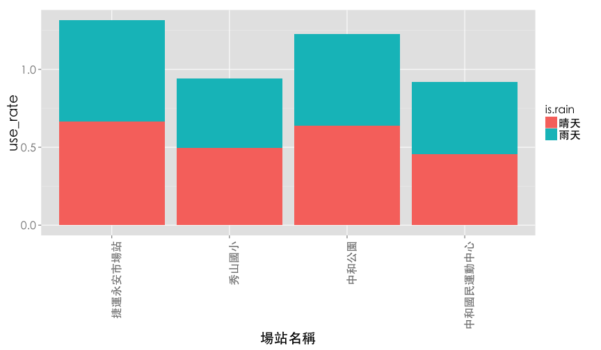
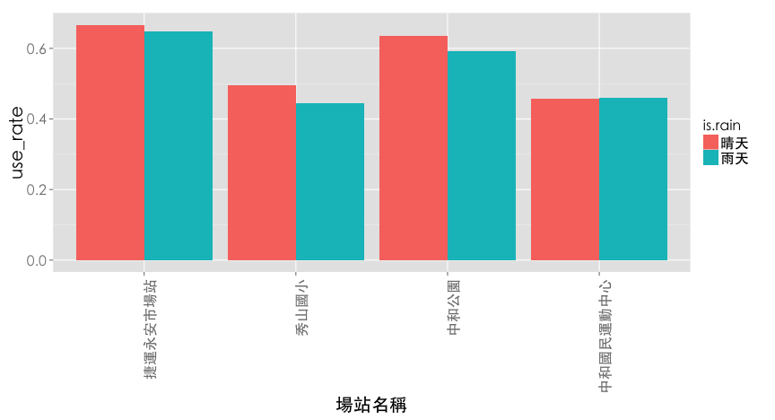
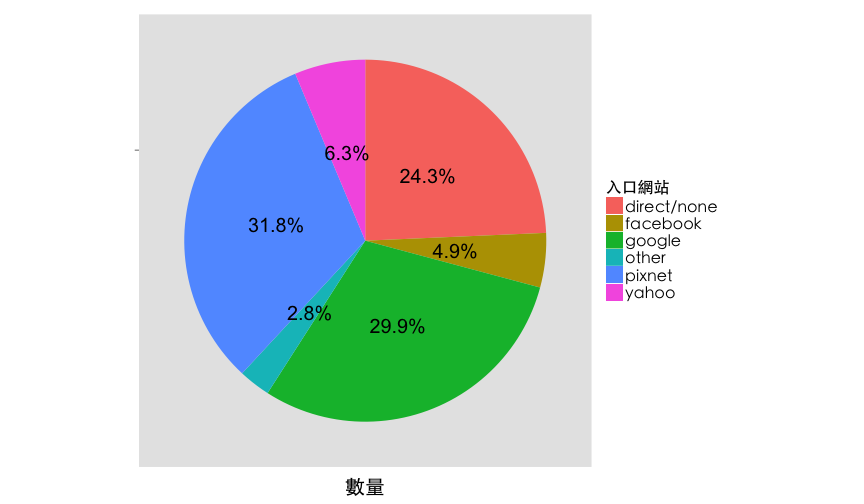
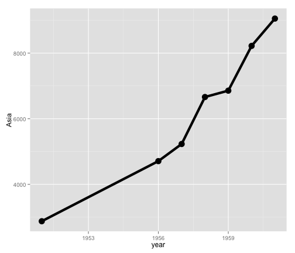
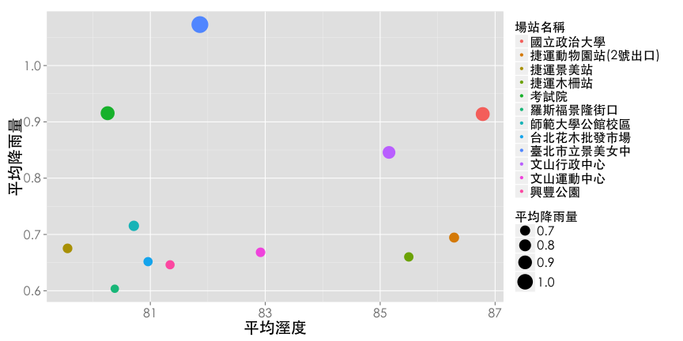
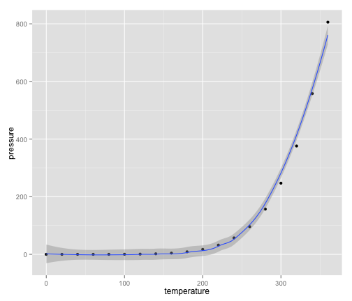
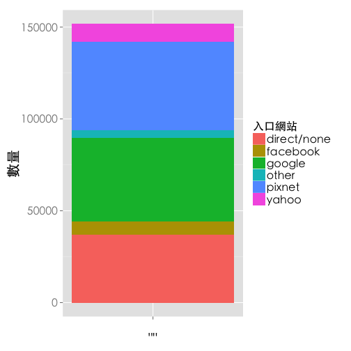
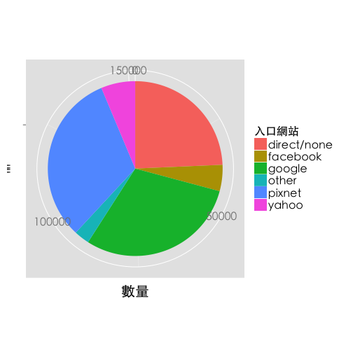
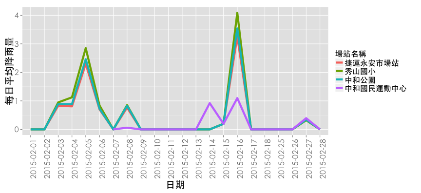
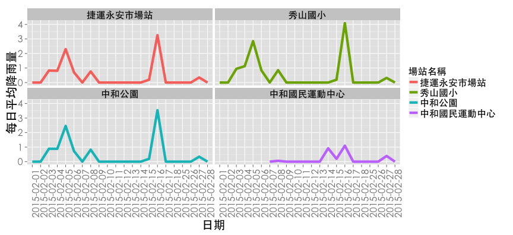

## 兩種類別


```r
ub2=filter(ubike, 場站區域=='中和區',時間==8) %>% 
  mutate(is.rain=降雨量>1) %>%
  mutate(is.rain=factor(is.rain, levels=c(FALSE, TRUE), 
                        labels = c("晴天","雨天"))) %>%
  select(日期,  平均空位數, 場站名稱, is.rain,總停車格) %>%
  group_by(場站名稱,  is.rain) %>%
  summarise(use_rate=mean(平均空位數/總停車格)) 
head(ub2)
```

```
## Source: local data frame [6 x 3]
## Groups: 場站名稱 [3]
## 
##         場站名稱 is.rain  use_rate
##           (fctr)  (fctr)     (dbl)
## 1 捷運永安市場站    晴天 0.6671052
## 2 捷運永安市場站    雨天 0.6483044
## 3       秀山國小    晴天 0.4966519
## 4       秀山國小    雨天 0.4436588
## 5       中和公園    晴天 0.6363115
## 6       中和公園    雨天 0.5917228
```

--- &vcenter .largecontent
## 兩種類別


```r
las2 <- theme(axis.text.x = element_text(angle = 90, hjust = 1),
              text=element_text(size=20,family="STHeiti")) #控制字的方向
ggplot(ub2,aes(x=場站名稱,y=use_rate,fill=is.rain))+
  geom_bar(stat='identity')+
  las2 # stat='identity'以表格的值做為bar的高度
```

--- &vcenter .largecontent
## 兩種類別: stack



--- &vcenter .largecontent
## 兩種類別: dodge


```r
ggplot(ub2,aes(x=場站名稱,y=use_rate,fill=is.rain))+
  geom_bar(stat='identity',position = 'dodge')+las2 #dodge類別並排
```



--- &vcenter .largecontent
## Pie Chart: Bar Chart變形
### 整理資料

```r
pix=data.frame(table(pixnet$referrer_venue)) #table可以算個類別個數
colnames(pix)=c('入口網站','數量')
pix[5,2]=pix[5,2]+pix[1,2]
pix=pix[-1,]
```

--- &vcenter .largecontent
## Pie Chart: Bar Chart變形
 

--- &vcenter .largecontent
## Pie Chart: Bar Chart變形

```r
ggplot(pix,aes(x="",y=數量,fill=入口網站))+
  geom_bar(stat='identity',width=1)+
  coord_polar('y')+
  geom_text(aes(y = 數量*0.5+ c(0, cumsum(數量)[-length(數量)]), 
                label = paste(round(數量/sum(數量),3)*100,'%',sep="")),
            size=7)+
  theme(axis.title.y = element_blank(),
        axis.text.x=element_blank(),
        panel.grid=element_blank(),
        text=element_text(size=20,family="STHeiti"))
```


--- .dark .segue

## The Grammer of Graphics

--- &vcenter .largecontent

## ggplot2基本架構

- 資料 (data) 和映射 (mapping)
- 幾何對象 (<font color='red'>geom</font>etric)
- 座標尺度 (<font color='red'>scale</font>)
- 統計轉換 (<font color='red'>stat</font>istics)
- 座標系統 (<font color='red'>coord</font>inante)
- 圖層 (layer)
- 刻面 (<font color='red'>facet</font>)
- 主題 (<font color='red'>theme</font>)

---
## Data and Mapping


```r
ggplot(data=WP.df)+geom_line(aes(x=year,y=Asia))
```

### Data is Data
### mapping: aes(x=...,y=...)

---
## <font color='red'>geom</font>etric

### geom_line and geom_point

```r
ggplot(WP.df,aes(x=year,y=Asia))+
  geom_line(size=2)+geom_point(size=5)
```



--- 
## <font color='red'>scale</font>


```r
ggplot(x3) +
  geom_point(aes(x =平均溼度, y=平均降雨量,colour=場站名稱,size=平均降雨量))+
  scale_size(range=c(5,10)) +thm
```



---
## <font color='red'>stat</font>istics


```r
 ggplot(pressure,aes(x=temperature,y=pressure))+
  geom_point()+
  stat_smooth()
```



--- &twocol .largecontent

## <font color='red'>coord</font>inante 

*** =left


```r
ggplot(pix,aes(x="",y=數量,fill=入口網站))+
  geom_bar(stat='identity')+thm
```

 

*** =right


```r
ggplot(pix,aes(x="",y=數量,fill=入口網站))+
  geom_bar(stat='identity',width=1)+
  coord_polar('y')+thm
```

 


--- 
## <font color='red'>facet</font>

```r
rain <- filter(ubike, grepl("2015-02", 日期, fixed = TRUE), 場站區域 == "中和區") %>%
  group_by(日期,場站名稱) %>% 
  summarise(每日平均降雨量 = mean(降雨量))
```

--- .largecontent

## <font color='red'>facet</font>
### Line Chart

```r
ggplot(rain) + thm+las2+
  geom_line(aes(x = 日期, y = 每日平均降雨量,group=場站名稱,colour=場站名稱),size=2)
```



--- .largecontent

## Line Chart in Facets


```r
ggplot(rain) +thm+las2+facet_wrap(~場站名稱,nrow=2)+ # facet_wrap將各站的情況分開畫
  geom_line(aes(x = 日期, y = 每日平均降雨量,group=場站名稱,colour=場站名稱),size=2)
```



--- .dark .segue
## 可以存檔嗎？

--- &vcenter .largecontent
## 存檔
    # 畫完圖之後，再存檔~~
    ggsave('檔案名稱')

--- .dark .segue
## 學習資源

--- &vcenter .largecontent

- [ggplot2 cheat sheet from RStudio Inc.](http://www.rstudio.com/wp-content/uploads/2015/03/ggplot2-cheatsheet.pdf)
- [ggplot2 官方文件](http://docs.ggplot2.org/current/index.html)

--- &vcenter .largecontent

## 本週目標

### 環境設定

- 建立可以使用R 的環境
- 了解R 的使用界面

### 學習R 語言

- 透過實際的範例學習R 語言
    - 讀取資料
    - 選取資料
    - 敘述統計量與視覺化

--- &vcenter .largecontent

## 掌握心法後，如何自行利用R 解決問題

- 了解自己的需求
- 詢問關鍵字與函數
    - 歡迎來信 <benjamin0901@gmail.com> 或其他教師
    - 多多交流
        - [Taiwan R User Group](http://www.meetup.com/Taiwan-R)，mailing list: <Taiwan-useR-Group-list@meetup.com>
        - ptt R_Language版
        - [R軟體使用者論壇](https://groups.google.com/forum/#!forum/taiwanruser)
    - `sos`套件，請見Demo


--- .dark .segue

## Team Project
